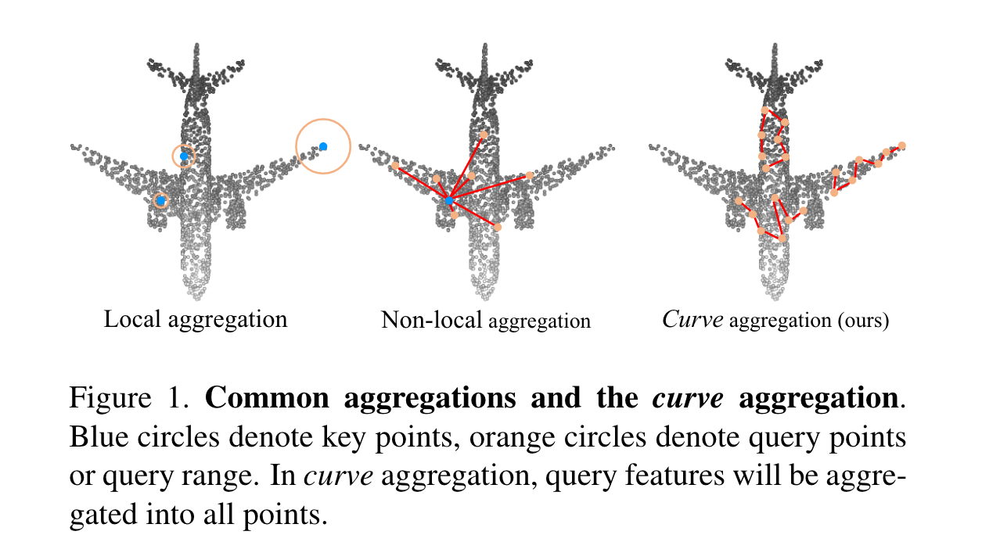
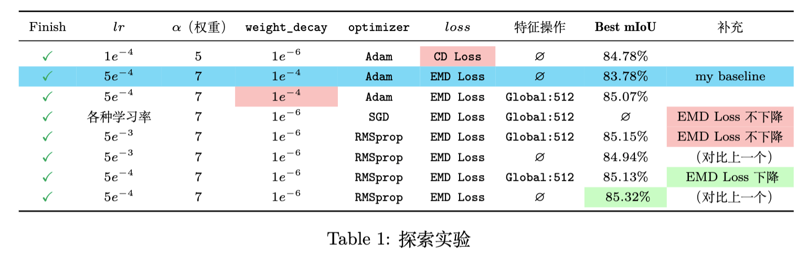

## 文柯力 CV 前期报告

> 精读论文：
>
> - FoldingNet: Point Cloud Auto-Encoder via Deep Grid Deformation (CVPR2018)
>- PointNeXt: Revisiting PointNet++ with Improved Training and Scaling Strategies (NIPS2022)
> 
> 泛读论文：
>
> - DGCNN: Dynamic Graph CNN for Learning on Point Clouds (TOG2019)
>- PointNet: Deep Learning on Point Sets for 3D Classification and Segmentation (CVPR2017)
> - PointNet++: Deep Hierarchical Feature Learning on Point Sets in a Metric Space (NIPS2017)
> - CurveNet: Walk in the Cloud: Learning Curves for Point Clouds Shape Analysis (ICCV2021)
> - Learning to Segment 3D Point Clouds in 2D Image Space (CPVR2020)

### 研究现状

（依据CurvetNet中的内容）

局部特征聚合是近年来被广泛研究的一种基本操作。对于每个关键点，其邻域点特征首先按预定义规则（例如KNN）进行分组。随后计算查询点与相邻点之间的相对位置编码，并将其传递到各种基于点的变换和聚合模块中进行局部特征提取。 尽管上述操作在一定程度上有助于描述局部模式，**但忽略了长程点关系**。 虽然非局部模块[34]提供了一种聚合全局特征的解决方案，但我们认为全局点到点映射可能仍然不足以提取点云形状隐含的底层模式。下图给出了三种特征聚合方式。

目前主要的关注点还是 Local aggregation，但是我认为 Non-local aggregation 仍有十足的研究潜力。

FoldingNet 是使用一个自动编码器去实现点云的重构，通过引入一个固定网格 和 folding 操作，把一个 2D 的网格折叠成一个 3 维点云，使得网格上的点和3维点云。我们直观的认为，在 FoldingNet 完成重建后，可以将生成的网格转化为一个补充的特征用于下游任务，由于2维网格上的信息和piont-wise的，因此我们可以构建 global feature 或者 local featrue。补充在 Encoder 部分得到的特征中，进行下游任务如：分类，部件分割。	

### 准备

目前考虑的是 DGCNN + FoldingNet 的组合。原因如下， DGCNN 的代码足够简单，可以直接替换 FoldingNet 中的原始的 Encoder。

目前，主要测试的是基于 ShapeNet-part 的 part-segmentation 的性能，由于 DGCNN 对于数据集的处理方式区别于原始的 PointNet，所以先将需要使用的数据集按 DGCNN 的方式进行处理。

原始的 FoldingNet 使用的是 Chamfer Distance 作为度量函数，但是 Chamfer Distance 实际上是一种基于 KNN 的距离函数，通过 CD 距离得到的 2D grid 到 3D 点云的映射可能出现多个点映射在同一个点的情况。用这样得到的grid去生成特征可能存在量化失真。因此，我们改用 EMD 距离（Earth Mover Distance），EMD 距离实际上是一个 NP 问题，我们通过迭代优化得到最终的结果，通过 EMD 得到的 grid 的映射效果应该更趋近于一一对应，理论上用EMD生成的 grid 得到的特征用于下游任务时会有更好的效果。

### 初步实验

目标：

- [x] 将 DGCNN 移植为 FoldingNet 的 Encoder，并处理出对应的数据集
- [x] 将原始的 CD Distance 改为 EMD Distance，配置对应的 Cuda 环境修改代码，返回 EMD 中的 flow 矩阵。
- [x] 使用不同的优化器对网络进行训练，探究最优秀的优化器。
- [x] 将 EMD 得到的 Flow 矩阵通过 ResNet18 得到对应的 global feature 作用 DGCNN 的特征补充进行实验。

当前实验得到的结果：

分析上文表格发现：

- 良好的优化器对模型的结果影响很大
- 当前特征操作（加上一个 由 grid 经过 Resnet18 得到的特征）效果并不明显，可能需要考虑其他的**特征操作**。