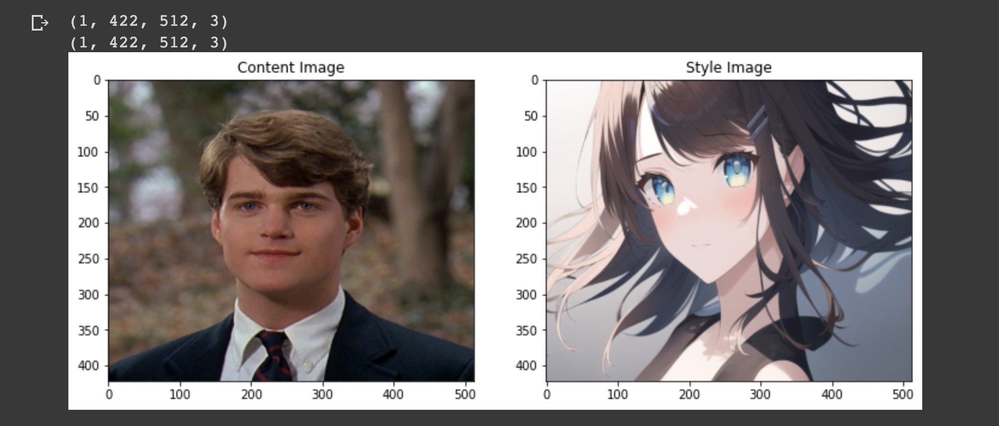

### 文柯力 CV 作业 #Week10

---

> [Deep Feature Rotation for Multimodal Image Style Transfer](https://paperswithcode.com/paper/deep-feature-rotation-for-multimodal-image-1)

**摘要翻译** 

最近，风格迁移是吸引许多人注意力的研究领域，主要用于将一张图片的风格转换到内容目标上。大量对于风格转换的研究主要针对如何加速处理和生成高质量的样式图片。大部分方法通过一个内容和样式的图片对去生成一个输出，然而少数一些方法使用复杂的结果然后仅能生产特定数量的输出。在本文中，我们提出了名叫 Deep Feature Rotation(DFR) 一种简单的方法用于表示样式特证，与更复杂的方法相比，它不仅可以产生不同的输出，而且还可以实现有效的样式化。我们的方法代表了中间特征嵌入的多种增强方法，而不会消耗太多的计算开销。我们通过在不同旋转权重下可视化输出结果对我们的方法进行了分析。

关键词：神经网络样式转换；转换学习；深度特征旋转

**贡献翻译** 

我们的主要贡献概括如下：

- 对不同特征旋转的合成输出进行了定性分析。
- 我们提出了一种新的端到端网络，该网络产生各种风格表示，每个风格表示基于不同角度的特定风格模式。
- 引入的旋转权重指示器清楚地显示了原始特征和旋转后特征之间的权衡。

**代码主体部分截图** 

**测试自己的图片截图** 

Content Image 和 Style Image 如下，我们希望一个动漫化的效果。

实验结果如下所示：

