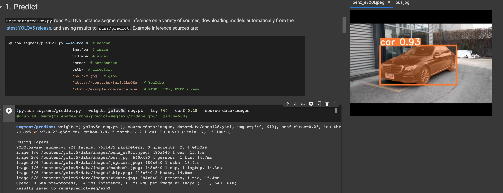
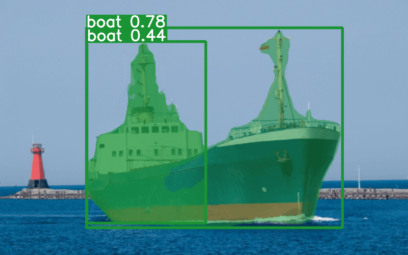
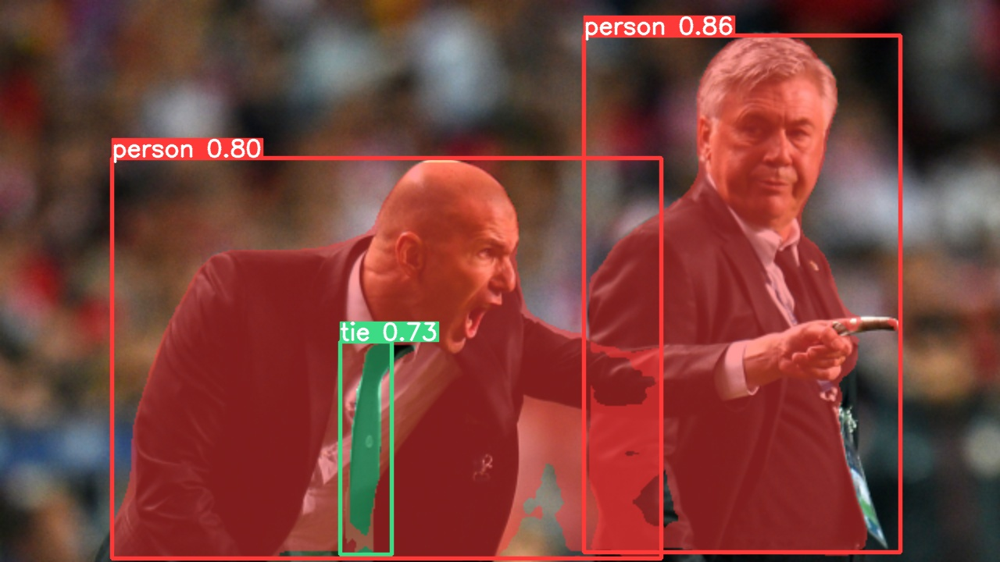
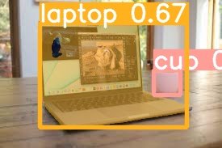
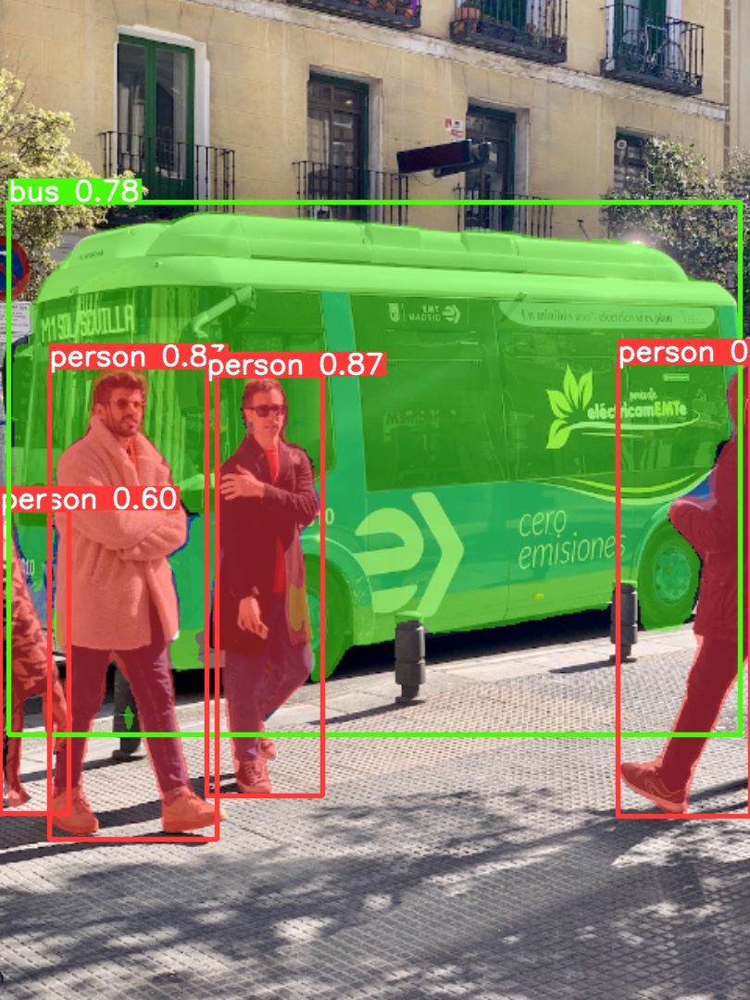
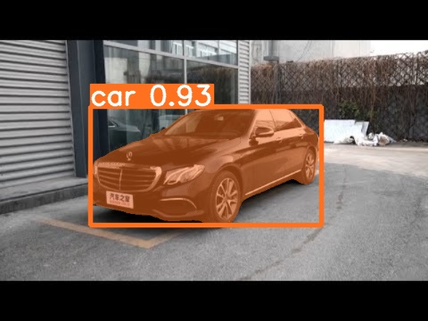

# 文柯力 CV Week#11 作业

> - 下载运行 YOLOv4(YOLOv5).py 代码，测试五幅图。
> - 文档中说明跟之前的版本的具体改进和不同。

下面是实验环境截图，通过给定的 `predict.py` 和使用预训练好的权重文件 `yolov5s-seg.pt` 对图片进行预测。

测试得到的图片如下：

### 说明 YOLOv5 和之前版本的不同之处

YoloV5 和之前版本的不同之处具体是？

1. 之前版本的yolo是将图片resize到 $416\times 416$，然后将图片分成13 $\times$ 13的网格，每个网格预测5个bounding box，每个bounding box预测$5$个值，分别是`x,y,w,h,confidence`，然后将这些值转换成真实的bounding box的值，然后将这些bounding box的值进行NMS，最后将NMS后的bounding box画出来。
2. YoloV5是将图片resize到 $640\times  640$ ，然后将图片分成 $20\times 20$ 的网格，每个网格预测3个bounding box，每个bounding box预测6个值，分别是`x,y,w,h,confidence,class`，然后将这些值转换成真实的bounding box的值，然后将这些bounding box的值进行NMS，最后将NMS后的bounding box画出来。

还有一些配置上的不同，配置文件的格式不同，之前版本的yolo是将配置文件写在代码里面，而YoloV5是将配置文件写在yaml文件里面，然后在代码里面读取yaml文件。

由于目标识别框架往往需要缩放原始图片尺寸，并且数据集中目标对象的大小可能也与COCO数据集不同，因此YOLO V5会重新**自动学习锚定框的尺寸**。但是 Yolo V4 仍然使用了固定的锚定框尺寸，这是因为 Yolo V4 的作者认为，锚定框的尺寸是固定的，不需要重新学习。

还有在损失函数的选择上，Yolo V4使用的是Mish激活函数，而Yolo V5使用的是Leaky ReLU激活函数，最后检测层使用 Sigmoid 激活函数。从性能上来说，Mish激活函数的性能要好于Leaky ReLU激活函数，但是Mish激活函数的计算量要大于Leaky ReLU激活函数，因此Yolo V5使用Leaky ReLU激活函数。